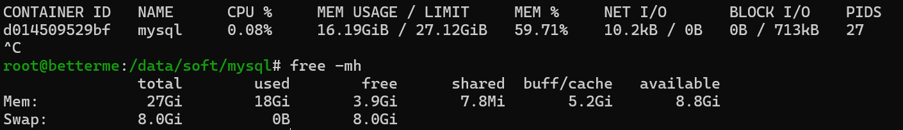

# 问题回顾
使用以下docker-compose.yaml启动了mysql容器。

启动成功后，使用free -mh查看宿主机内存占用情况，并用docket stats 查看容器情况，mysql竟然占用了16个G

## docker-compose.yaml
```yaml
version: '3.9'
services:
  mysql:
    image: mysql:5.7.29
    restart: on-failure
    container_name: mysql
    environment:
      - TZ=Asia/Shanghai
      - MYSQL_ROOT_PASSWORD=123456
    volumes:
      - /etc/localtime:/etc/localtime:ro
      - ${PWD}/config/my.cnf:/etc/mysql/my.cnf
      - ${PWD}/data:/var/lib/mysql
      - ${PWD}/logs:/usr/local/mysql/log
    ports:
      - 3306:3306
```
## my.cnf 配置
```
[mysqld]
lower_case_table_names=1
port=3306
```

## docker stats Mysql占用了16G


## 问题排查

进入到容器内部
```shell
docker exec -it mysql
```

使用top命令，提示命令不存在，那么执行下面命令，安装top命令
```shell
apt install procps
```

执行top，并按m键，发现只有mysqld这个进程占用内存。


这就很奇怪了。

在google下发现了这篇文章。

[**docker启动mysql时内存占用过多**](https://blog.chenwx.top/p/docker-mysql-event1.html)


# 原因分析：
文章指出
**这个问题的直接原因是文件描述符上限太大了;**

## 原文截图


于是我修改下docker-compose启动脚本
```yaml
version: '3.9'
services:
  mysql:
    image: mysql:5.7.29
    restart: on-failure
    container_name: mysql
    environment:
      - TZ=Asia/Shanghai
      - MYSQL_ROOT_PASSWORD=123456
    ulimits:
      nproc: 65535
      nofile:
        soft: 26677
        hard: 46677
    volumes:
      - /etc/localtime:/etc/localtime:ro
      - ${PWD}/config/my.cnf:/etc/mysql/my.cnf
      - ${PWD}/data:/var/lib/mysql
      - ${PWD}/logs:/usr/local/mysql/log
    ports:
      - 3306:3306
```
重新run了容器，发现内存下来了。
```shell
root@betterme:/data/soft/mysql# free -mh
               total        used        free      shared  buff/cache   available
Mem:            27Gi       2.3Gi        19Gi       7.8Mi       5.2Gi        24Gi
Swap:          8.0Gi          0B       8.0Gi
```